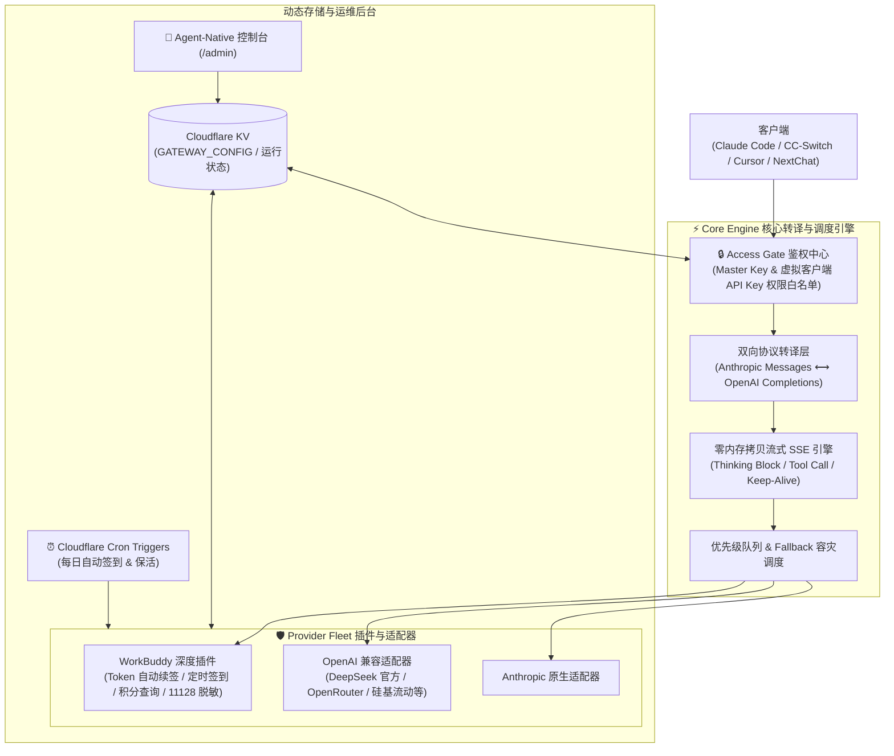

# ⚡ Worker-AI-Gateway

<div align="center">

**基于 Cloudflare Workers 的全能型轻量级 AI 统一网关 (Worker-One-API)**

[](https://github.com/Ericsunsk/Worker-AI-Gateway)
[](LICENSE)
[](https://workers.cloudflare.com/)
[]()
[]()

[特性介绍](#-核心特性) • [系统架构](#-系统架构) • [快速部署](#-快速部署方案) • [客户端接入](#-客户端接入指南) • [API 参考](#-端点总览-api-reference) • [FAQ](#-常见问题-faq)

</div>

---

## 📖 简介

**Worker-AI-Gateway** 是一款运行在 Cloudflare Workers 边缘计算平台上的高性能通用 AI 网关。它不仅能实现 **Anthropic ⟷ OpenAI 双向跨协议转译**，还深度集成了 **腾讯云代码助手 (WorkBuddy / CodeBuddy)** 插件，完美解决 **Claude Code 11128 拦截**、**无感 Token 自动续期**、**每日定时自动签到领积分** 以及 **CC-Switch 桌面端实时积分余额卡片** 展示。

无论你是个人开发者需要稳定使用 DeepSeek / Claude Code，还是团队需要一套低成本、免服务器维护、支持故障自动 Fallback 的 AI 网关，本项目都能开箱即用。

---

## ✨ 核心特性

| 功能维度 | 原生直连 / 传统反代 | ⚡ Worker-AI-Gateway |
| :--- | :--- | :--- |
| **协议支持** | 仅支持单一上游格式 | **双向转译**：同时对外暴露 `/v1/messages` (Claude) 与 `/v1/chat/completions` (OpenAI) |
| **思维链 & 工具** | 易丢失或乱码 | **完整支持**：原生还原 `thinking` 推理流、Tool Calling 函数调用与心跳保活 |
| **多上游容灾 (Fallback)** | 单点故障，429/超时直接报错 | **优先级队列**：遇 429、5xx 或风控秒级自动切换备用上游（如 OpenRouter / 官方 DeepSeek） |
| **WorkBuddy 凭证保活** | 几天后 Token 过期需手动重新登录 | **无感刷新**：后台通过 RefreshToken 自动无感续签，长效免维护 |
| **每日领积分** | 容易忘记签到导致积分耗尽 | **自动签到**：Cloudflare Cron 每日两次自动执行签到，结果入库 KV |
| **CC-Switch 余额显示** | 无法显示 WorkBuddy 积分 | **专属端点**：提供 `/v1/usage`，配合脚本无缝在 CC-Switch 显示剩余积分 |
| **11128 关键字拦截** | Claude Code 无法调用 WorkBuddy | **快速短路脱敏**：独家指纹脱敏，O(1) 短路探测，彻底规避风控拦截 |
| **配置热更新** | 必须重新部署代码 | **Agent-Native 控制台**：访问 `/admin` 自解释规范，AI 智能体直接读取与热更新配置，改动秒级生效 |
| **响应延迟** | 每次查 KV 额外浪费 30~80ms | **L1 内存热缓存**：内存级 0.001ms 直出，节省 98% KV 读配额 |

---

## 🏗️ 系统架构



---

## 🚀 快速部署方案

### 方案 A：Cloudflare 控制台连接 GitHub 自动部署（⭐️ 官方推荐，免命令行）

Cloudflare Workers 现已原生支持 Git 仓库集成，只需要关联一次 GitHub，后续每次代码有更新，Cloudflare 会**全自动构建并发布**。

1. **Fork 或使用本项目**：确保仓库已存在于你的 GitHub 账号下（如 `你的用户名/Worker-AI-Gateway`）。
2. **创建 KV 数据库**：
   - 打开 [Cloudflare 控制台](https://dash.cloudflare.com/) ➔ 进入 **Storage & Databases** ➔ **KV**。
   - 点击 **Create Namespace**，名称填写 `GATEWAY_KV`。
   - 记录下生成的 **Namespace ID**。
3. **连接 GitHub 仓库**：
   - 进入 Cloudflare 控制台 ➔ **Workers & Pages** ➔ 点击 **Create** ➔ **Workers** ➔ 选择 **Import from Git**（或在已有 Worker 的 **Settings** ➔ **Builds** 中点击 **Connect Git repository**）。
   - 授权并选择你的仓库：`Worker-AI-Gateway`。
   - **生产分支**：`main`。
   - **构建命令**：`npm install`。
   - **部署命令**：`npx wrangler deploy`。
4. **配置环境变量与 KV 绑定**：
   - 在 Worker 的 **Settings** ➔ **Bindings** 中，添加 KV 绑定：
     - Variable name: `GATEWAY_KV`
     - KV namespace: 选择第 2 步创建的 `GATEWAY_KV`
   - 在 **Settings** ➔ **Variables and Secrets** 中，配置基础凭据：
     - `API_KEY`: 客户端调用的默认 Key（如 `sk-workbuddy-gateway`）
     - `MASTER_KEY`: 管理后台的主密钥（如 `your-admin-password`）
     - `USER_ID`: 你的腾讯云代码助手用户 ID
     - `ACCESS_TOKEN`: 你的 WorkBuddy AccessToken
     - `REFRESH_TOKEN`: 你的 WorkBuddy RefreshToken
5. 点击 **Save and Deploy**，1 分钟内完成全自动部署！

---

### 方案 B：本地 Wrangler CLI 命令行部署

1. **克隆项目并安装依赖**：
   ```bash
   git clone https://github.com/Ericsunsk/Worker-AI-Gateway.git
   cd worker-ai-gateway
   npm install
   ```

2. **登录 Cloudflare 并创建 KV**：
   ```bash
   npx wrangler login
   npx wrangler kv namespace create GATEWAY_KV
   ```
   记录终端返回的 KV `id`。

3. **配置凭据**：
   ```bash
   cp wrangler.example.jsonc wrangler.jsonc
   ```
   编辑 `wrangler.jsonc`，将你的 KV ID 填入配置中。本地私密环境变量可直接写入 `.dev.vars`：
   ```ini
   API_KEY=sk-workbuddy-gateway
   MASTER_KEY=admin-secret-key
   USER_ID=你的腾讯云用户ID
   ACCESS_TOKEN=你的AccessToken
   REFRESH_TOKEN=你的RefreshToken
   ```

4. **一键发布**：
   ```bash
   npm run deploy
   ```

---

## 📱 客户端接入指南

### 1. CC-Switch 客户端接入（带实时积分余额卡片）

在 CC-Switch 中点击 **添加供应商**：
- **供应商名称**：`WorkBuddy`
- **API URL**：`https://你的worker域名.workers.dev`
- **API Key**：`sk-workbuddy-gateway`（或自定义的 Key）
- **协议类型**：`Anthropic`

#### 注入余额查询脚本（即时展示剩余积分）：
在 CC-Switch 供应商卡片的高级设置或余额脚本中填入：
```javascript
({
  request: {
    url: "{{baseUrl}}/v1/usage",
    method: "GET",
    headers: {
      "Authorization": "Bearer {{apiKey}}",
      "User-Agent": "cc-switch/1.0"
    }
  },
  extractor: function(response) {
    const balance = Number(response?.data?.balance);
    if (!Number.isFinite(balance)) {
      return {
        isValid: false,
        invalidMessage: "WorkBuddy 积分读取中..."
      };
    }
    return {
      isValid: true,
      remaining: balance,
      unit: response?.data?.unit || "积分",
      extra: "WorkBuddy 剩余积分"
    };
  }
})
```
保存后，CC-Switch 卡片右上角即可实时显示类似：
> **剩余：598.54 积分 WorkBuddy 剩余积分**

---

### 2. Claude Code 终端 CLI 接入

彻底解决官方直连触发的 **11128 风控错误**：
```bash
export ANTHROPIC_BASE_URL="https://你的worker域名.workers.dev"
export ANTHROPIC_API_KEY="sk-workbuddy-gateway"

# 启动 Claude Code
claude
```

---

### 3. Cursor / NextChat / OpenAI 生态客户端

- **API 接口地址**：`https://你的worker域名.workers.dev/v1`
- **API Key**：`sk-workbuddy-gateway`
- **推荐模型**：
  - `deepseek-v4.1-flash`
  - `deepseek-v4-pro`
  - `claude-3-7-sonnet-20250219`
  - `claude-3-5-sonnet-20241022`

---

## 🤖 Agent-Native 智能体控制台 (`/admin`)

网关专为 **AI 智能体与自动化运维** 设计，彻底移除了冗余的人类 Web 前端，获取极致的轻量化与边缘冷启动性能：

* 🧭 **自解释规范 (`GET /admin`)**：公开返回网关完整的 API 规范、鉴权指引与端点索引，Agent 可自主理解并操作。
* 📝 **配置热读写 (`GET/POST /admin/api/config`)**：携带 `MASTER_KEY` 直接读写全量 JSON 配置，包含上游提供商、模型路由链路与虚拟客户端密钥，KV 秒级热更新生效。
* 📊 **状态监控 (`GET /admin/api/status`)**：获取聚合积分余额、账号池健康度、最后签到记录及当前可用模型数。
* ⚡ **运维控制 (`POST /admin/api/checkin` & `POST /admin/api/refresh`)**：一键对多账号池执行每日签到或强制刷新 AccessToken。

---

## 📡 端点总览 (API Reference)

| 路径 (Path) | 方法 | 鉴权要求 | 说明 |
| :--- | :--- | :--- | :--- |
| `/v1/messages` | `POST` | Virtual Key / Master Key | 标准 Anthropic Messages 接口（适配 Claude Code） |
| `/v1/chat/completions` | `POST` | Virtual Key / Master Key | 标准 OpenAI 对话接口（适配 Cursor / NextChat） |
| `/v1/models` | `GET` | Virtual Key / Master Key | 返回当前网关已配置的所有可用模型列表 |
| `/v1/usage` | `GET` | Virtual Key / Master Key | CC-Switch 专用的实时积分/额度查询接口 |
| `/admin` | `GET` | 公开 | Agent-Native 自解释规范与端点导航索引 |
| `/admin/api/*` | `*` | Master Key Required | 管理后台后端 REST API（配置热存、状态查询、运维动作） |
| `/status` | `GET` | 公开 | Worker 运行状态与最近签到日志健康检查 |
| `/checkin` | `POST/GET` | Virtual Key / Master Key | 手动触发所有激活渠道执行签到 |
| `/healthz` | `GET` | 公开 | 容器存活心跳探测 |

---

## ❓ 常见问题 (FAQ)

<details>
<summary><b>Q: 如何获取腾讯云代码助手的 Token 和 User-Id？</b></summary>

1. 在本地打开 CodeBuddy / WorkBuddy 客户端（或 VS Code 腾讯云 AI 代码助手插件）。
2. 在用户目录的配置文件中（或通过网络抓包）查找：
   - `User-Id`: 格式通常形如 UUID `62e37411-ceca-4483-a7eb-caa9d70fa5ff`
   - `AccessToken`: JWT 字符串（RS256 签名）
   - `RefreshToken`: 离线长效刷新令牌（HS512 签名）
3. 只要填入了 `RefreshToken`，网关就能自动为你永久续签 AccessToken。
</details>

<details>
<summary><b>Q: 什么是 11128 错误？网关是如何解决的？</b></summary>

腾讯云对请求上文做了关键词检测，当发现 Claude Code 默认注入的 System Prompt（如 `"You are Claude Code, Anthropic's official CLI for Claude."`）时，会返回 `11128: 敏感指令拦截`。  
网关内置了高性能的短路脱敏引擎，在保持长文本 O(1) 极速处理的同时，精准重写敏感标识并剔除特征 Header，让 Claude Code 可以顺畅使用 WorkBuddy 模型。
</details>

<details>
<summary><b>Q: 自动签到什么时候触发？</b></summary>

在 `wrangler.jsonc` 中配置了 Cloudflare 定时触发器：
`"crons": ["0 1 * * *", "0 13 * * *"]`  
分别对应北京时间 **每天 09:00 和 21:00** 自动触发签到与 Token 保活，无需任何人工干预。
</details>

<details>
<summary><b>Q: 如何配置备用模型（例如 OpenRouter）？</b></summary>

登录 `/admin` 控制台，在 **上游提供商** 中开启 OpenRouter 并填入你的 OpenRouter API Key，然后在 **模型路由** 中把 `deepseek-v4.1-flash` 的候选列表设置为：
1. `workbuddy -> deepseek-v4.1-flash`
2. `openrouter -> deepseek/deepseek-chat`  
保存后即时生效！一旦 WorkBuddy 额度耗尽或发生限流，请求会自动重试并降级到 OpenRouter。
</details>

---

## 📄 开源许可证

本项目基于 [MIT License](LICENSE) 开源协议。欢迎提交 PR 和 Issue！
