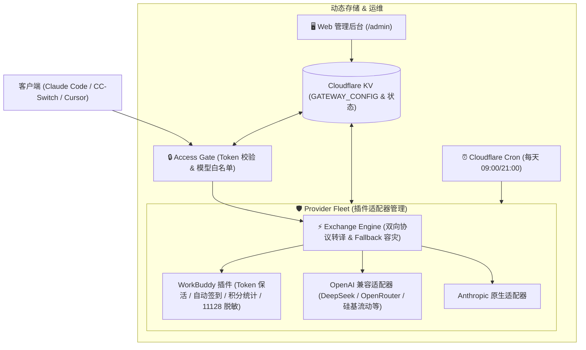

# ⚡ Worker-AI-Gateway

> 基于 **Cloudflare Workers** 的轻量级、高性能通用 AI 统一网关（Worker-One-API）。  
> 原生支持 **Anthropic ⟷ OpenAI 双向协议转译**、**多上游优先级路由与容灾降级（Fallback）**、**WorkBuddy (腾讯云代码助手) 深度保活/签到/用量插件**、**多客户端虚拟 API Key 权限控制** 以及 **免重新部署的动态 Web 管理控制台**。

[](LICENSE)
[](https://workers.cloudflare.com/)
[]()

---

## ✨ 核心特性

- ⚡ **双向跨协议转译引擎**：
  - 对外同时暴露标准的 Anthropic（`/v1/messages`）与 OpenAI（`/v1/chat/completions`）双标准接口。
  - 支持将 Claude Code / CC-Switch 等客户端请求无缝转译为 OpenAI 兼容上游（DeepSeek、OpenRouter 等），并完整兼容 **思维链（Thinking / Reasoning Content）**、**函数调用（Tool Calling）** 及 **流式 SSE 状态机与心跳保活**。
- 🔀 **模型优先级路由与自动容灾（Fallback）**：
  - 每个模型或别名可绑定候选上游列表（如 `[WorkBuddy-主账号, OpenRouter-备用]`）。
  - 当首选上游遭遇 `429`（配额耗尽/限流）、`5xx` 故障或风控拦截时，网关自动秒级平滑重试备用渠道，保障开发流永不断连。
- 🤖 **WorkBuddy (腾讯云代码助手) 深度适配插件**：
  - **自动 Token 刷新**：根据 RefreshToken 自动无感续签 AccessToken，长效免维护。
  - **每日定时自动签到**：利用 Cloudflare Cron Triggers 每天定时自动执行签到领积分，状态自动入库 KV。
  - **积分用量实时查询**：逆向解析腾讯云资源包接口，提供 `/v1/usage` 端点，完美适配 **CC-Switch** 桌面端的余额展示卡片与 30s 自动轮询。
  - **指纹脱敏清洗**：独家内置快速短路脱敏引擎，彻底绕过上游对 Claude Code 和 Codex CLI 的关键字风控（解决 11128 拦截）。
- 🖥️ **内置 Web 管理控制台（访问 `/admin`）**：
  - 单页响应式深色极简 UI，输入 Master Key 即可直接进入。
  - 支持查看剩余积分、自动签到历史日志、在线可视化开关提供商、调整模型 Fallback 链路及热编辑全局配置。
- 🔑 **多客户端虚拟 API Key 管理**：
  - 区分最高权限的 Master Key 与分发给不同客户端（如 Claude Code、Cursor、CC-Switch）的虚拟 API Key。
  - 支持独立启停和按 Key 设置允许访问的模型白名单。
- 🚀 **极致性能架构**：
  - **L1 内存热缓存**：在 Worker 常驻内存中维护高频配置与 Token 缓存，彻底消除了每次请求对 KV 的跨网络往返（前置耗时从 30~80ms 降至 0.001ms）。
  - **长文本脱敏快速短路**：针对百 K 级长上下文（100k+ tokens），通过前置特征探测实现 O(1) 瞬时短路返回，CPU 耗时降低 90% 以上。
  - **SSE 零内存分配**：预编译保活与结束帧 Buffer，消除流式打字过程中的频繁垃圾回收。

---

## 🏗️ 系统架构



---

## 🚀 快速开始

### 1. 准备工作
- 拥有一个 [Cloudflare](https://dash.cloudflare.com/) 账号。
- 本地安装 Node.js (>= 18) 与 npm。

### 2. 克隆项目与安装依赖
```bash
git clone https://github.com/Ericsunsk/worker-ai-gateway.git
cd worker-ai-gateway
npm install
```

### 3. 创建 Cloudflare KV 命名空间
运行以下命令创建一个 KV 数据库，用于存放动态配置与 Token：
```bash
npx wrangler kv namespace create WORKBUDDY_KV
```
执行后终端会输出类似如下绑定配置：
```json
{ "binding": "WORKBUDDY_KV", "id": "xxxxxxxxxxxxxxxxxxxxxxxxxxxxxxxx" }
```

### 4. 配置本地环境变量
复制配置文件模板：
```bash
cp wrangler.example.jsonc wrangler.jsonc
```
编辑 `wrangler.jsonc`，填入你的 KV ID 和初始凭据：
```jsonc
{
  "name": "worker-ai-gateway",
  "main": "src/index.js",
  "compatibility_date": "2024-09-23",
  "kv_namespaces": [
    {
      "binding": "WORKBUDDY_KV",
      "id": "填入上一步生成的 KV ID"
    }
  ],
  "triggers": {
    "crons": ["0 1 * * *", "0 13 * * *"] // 每天北京时间 09:00 和 21:00 自动签到
  },
  "vars": {
    "API_KEY": "sk-workbuddy-gateway",        // 默认客户端 API Key
    "MASTER_KEY": "your-admin-secret-key",    // 管理后台 Master Key
    "USER_ID": "你的腾讯云代码助手用户 ID",
    "ACCESS_TOKEN": "你的 AccessToken",
    "REFRESH_TOKEN": "你的 RefreshToken"
  }
}
```

### 5. 部署到 Cloudflare
```bash
npm run deploy
```
部署完成后，Cloudflare 将为您分配一个域名，形如：
`https://worker-ai-gateway.<your-subdomain>.workers.dev`

---

## 🛠️ 客户端接入指南

### 1. CC-Switch 接入（带余额显示）
在 CC-Switch 客户端中添加自定义供应商：
- **供应商名称**：`WorkBuddy`
- **Base URL**：`https://your-worker.workers.dev`
- **API Key**：`sk-workbuddy-gateway`
- **协议格式**：`Anthropic`

**配置余额脚本**（可在 CC-Switch 设置或数据库中直接注入）：
```javascript
({
  request: {
    url: "{{baseUrl}}/v1/usage",
    method: "GET",
    headers: {
      "Authorization": "Bearer {{apiKey}}",
      "User-Agent": "cc-switch/1.0"
    }
  },
  extractor: function(response) {
    const balance = Number(response?.data?.balance);
    if (!Number.isFinite(balance)) {
      return { isValid: false, invalidMessage: "积分暂时无法读取" };
    }
    return {
      isValid: true,
      remaining: balance,
      unit: response?.data?.unit || "积分",
      extra: "WorkBuddy 剩余积分"
    };
  }
})
```

### 2. Claude Code 接入
```bash
export ANTHROPIC_BASE_URL="https://your-worker.workers.dev"
export ANTHROPIC_API_KEY="sk-workbuddy-gateway"
claude
```

### 3. Cursor / NextChat / OpenAI 客户端接入
- **API 域名**：`https://your-worker.workers.dev/v1`
- **API Key**：`sk-workbuddy-gateway`
- **模型名称**：`deepseek-v4.1-flash`、`deepseek-v4-pro`、`claude-3-7-sonnet-20250219` 等

---

## 🖥️ 动态管理后台 (`/admin`)

浏览器打开 `https://your-worker.workers.dev/admin`，输入你的 `MASTER_KEY`：
- **状态看板**：实时查看当前积分、自动签到执行状态、活跃提供商与模型数。
- **一键运维**：支持手动立即签到、强制刷新 Token。
- **热更新配置**：无需执行 `wrangler deploy`，随时在线修改模型路由优先级、添加备用上游（如 OpenRouter）及分发独立 Key。

---

## 📄 开源许可证

本项目基于 [MIT License](LICENSE) 协议开源。
