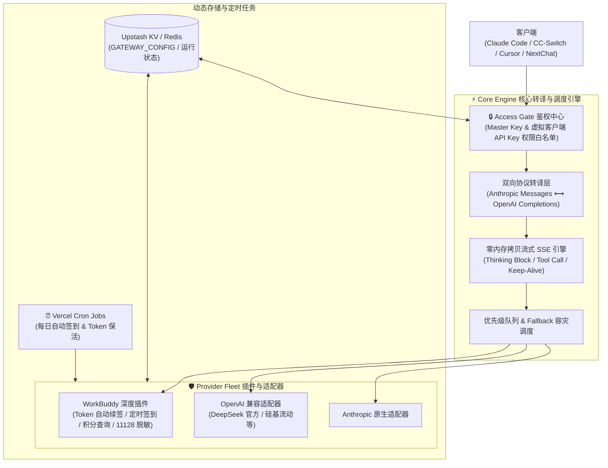

# ⚡ Universal-AI-Gateway

<div align="center">

**通用全功能 AI 统一网关 (Vercel Serverless 架构，彻底告别 10ms CPU 限制)**

[](https://github.com/Ericsunsk/Universal-AI-Gateway)
[](LICENSE)
[](https://vercel.com/)
[]()
[]()

[特性介绍](#-核心特性) • [系统架构](#-系统架构) • [快速部署](#-快速部署方案) • [客户端接入](#-客户端接入指南) • [API 参考](#-端点总览-api-reference) • [FAQ](#-常见问题-faq)

</div>

---

## 📖 简介

**Universal-AI-Gateway** 是一款面向 **Vercel Serverless** 与 Node.js 运行时的高性能多平台 AI 网关。它不仅能实现 **Anthropic ⟷ OpenAI 双向跨协议转译**，还深度集成了 **腾讯云代码助手 (WorkBuddy / CodeBuddy)**，完美解决 **Claude Code 11128 敏感词拦截**、**无感 Token 自动续签**、**每日定时自动签到领积分**、**突破传统边缘环境的 CPU/内存限制** 以及 **CC-Switch 桌面端实时积分余额卡片** 展示。

Vercel 实例提供 **1024MB RAM** 与长达 **300 秒执行时间**，彻底根除长对话上下文（如 Claude Code 深度审计、上千条消息）引发的 CPU/内存超时崩溃问题。

---

## ✨ 核心特性

| 功能维度 | 原生直连 / 传统反代 | ⚡ Universal-AI-Gateway (Vercel) |
| :--- | :--- | :--- |
| **协议支持** | 仅支持单一上游格式 | **双向转译**：同时对外暴露 `/v1/messages` (Claude) 与 `/v1/chat/completions` (OpenAI) |
| **思维链 & 工具** | 易丢失或乱码 | **完整支持**：原生还原 `thinking` 推理流、Tool Calling 函数调用与长连接保活 |
| **多上游容灾 (Fallback)** | 单点故障，429/超时直接报错 | **优先级队列**：遇 429、5xx 或风控秒级自动切换备用上游（如 WorkBuddy 多账号 / DeepSeek 官方） |
| **WorkBuddy 凭证保活** | 几天后 Token 过期需手动重新登录 | **无感续签**：后台通过 RefreshToken 自动无感续签，长效免维护 |
| **每日领积分 & 保活** | 容易忘记签到导致积分耗尽 | **自动签到保活**：Vercel Cron 每日定时自动执行签到与 Token 刷新，数据入库 Upstash KV |
| **CC-Switch 余额显示** | 无法显示 WorkBuddy 积分 | **专属端点**：提供 `/v1/usage`，配合脚本无缝在 CC-Switch 显示剩余积分 |
| **11128 关键字拦截** | Claude Code 无法调用 WorkBuddy | **快速短路脱敏**：独家指纹脱敏，O(1) 短路探测，彻底规避风控拦截 |
| **配置热更新** | 必须重新部署代码 | **KV 直行**：直接改 KV 中的 `GATEWAY_CONFIG`（记得同步 bump `config_version`），60 秒内全实例生效 |
| **长上下文保真** | 受边缘 CPU 限制不得不裁剪历史 | **零限制全量保真**：Vercel 充足算力默认 0 剪枝，完整保留全部轮次历史 |

---

## 🏗️ 系统架构



> 🔧 **开发者**：项目源码按领域分层组织于 `src/`（`http/` `config/` `auth/` `exchange/` `providers/`），领域词汇表见 [`CONTEXT.md`](CONTEXT.md)。

---

## 🚀 快速部署方案

### 方案 A：Vercel 仪表盘一键连接 GitHub 部署（⭐️ 推荐）

Vercel 原生支持 Git 仓库持续集成，关联后每次代码推送会自动完成构建与发布。

1. **Fork 或克隆本项目**：确保代码在你的 GitHub 账号下。
2. **导入 Vercel 项目**：
   - 访问 [Vercel 仪表盘](https://vercel.com/new)，选择并导入你的仓库。
   - Framework Preset 保持为 `Other`。
3. **配置环境变量 (Environment Variables)**：
   在项目设置中添加以下环境变量：
   - `API_KEY`: 客户端调用的默认 Key（如 `sk-workbuddy-deepseek`）
   - `MASTER_KEY`: 管理后台主密钥（如 `your-master-password`）
   - `USER_ID`: 你的腾讯云代码助手用户 ID
   - `ACCESS_TOKEN`: 你的 WorkBuddy AccessToken
   - `REFRESH_TOKEN`: 你的 WorkBuddy RefreshToken
   - *(可选)* `CRON_SECRET`: Vercel Cron 定时任务鉴权密钥（自动签到与 Token 保活安全校验）
   - *(可选)* `KV_REST_API_URL` & `KV_REST_API_TOKEN`: 若需要持久化配置，可在 Vercel Storage 中一键创建免费 Upstash Redis / Vercel KV，系统将全自动接入；不填则默认使用高效内存级热缓存。
4. **点击 Deploy**：
   数十秒即可完成部署并获得类似 `https://your-gateway.vercel.app` 的访问链接。

---

### 方案 B：本地 Vercel CLI 命令行一键部署

1. **安装依赖并登录**：
   ```bash
   npm install
   npx vercel login
   ```

2. **本地联调开发**：
   ```bash
   npm run dev
   ```

3. **一键发布到生产环境**：
   ```bash
   npm run deploy
   ```

---

## 📱 客户端接入指南

### 1. CC-Switch 客户端接入（带实时积分余额卡片）

在 CC-Switch 中点击 **添加供应商**：
- **供应商名称**：`WorkBuddy`
- **API URL**：`https://your-gateway.vercel.app`
- **API Key**：`sk-workbuddy-deepseek`
- **协议类型**：`Anthropic`

#### 注入余额查询脚本（即时展示剩余积分）：
在 CC-Switch 供应商卡片的高级设置或余额脚本中填入：
```javascript
({
  request: {
    url: "{{baseUrl}}/v1/usage",
    method: "GET",
    headers: {
      "Authorization": "Bearer {{apiKey}}",
      "User-Agent": "cc-switch/1.0"
    }
  },
  extractor: function(response) {
    const balance = Number(response?.data?.balance);
    if (!Number.isFinite(balance)) {
      return {
        isValid: false,
        invalidMessage: "WorkBuddy 积分读取中..."
      };
    }
    return {
      isValid: true,
      remaining: balance,
      unit: response?.data?.unit || "积分",
      extra: "WorkBuddy 剩余积分"
    };
  }
})
```
保存后，CC-Switch 卡片右上角即可实时显示剩余积分。

---

### 2. Claude Code 终端 CLI 接入

彻底解决官方直连触发的 **11128 风控错误**：
```bash
export ANTHROPIC_BASE_URL="https://your-gateway.vercel.app"
export ANTHROPIC_API_KEY="sk-workbuddy-deepseek"

# 启动 Claude Code
claude
```

---

### 3. Cursor / NextChat / OpenAI 生态客户端

- **API 接口地址**：`https://your-gateway.vercel.app/v1`
- **API Key**：`sk-workbuddy-deepseek`
- **可用模型**：网关默认**透明直通**——不在 `routes` 中声明的模型名会直接透传给默认上游（`default_provider`，默认为 `workbuddy`），因此**上游支持的任意模型名均可直接调用**，无需预先配置。例如上游支持的 `deepseek-v4.1-flash`、`deepseek-v4-pro` 等。
  > 透明直通意味着"新模型免配置即可用"，代价是已鉴权客户端的**未知模型名会真实打一次上游**（上游拒收回 502）。不要把不可信的模型名暴露给按次计费的上游；如需严格限制，可在 `GATEWAY_CONFIG.routes` 中显式声明白名单。

---

## 📡 端点总览 (API Reference)

| 路径 (Path) | 方法 | 鉴权要求 | 说明 |
| :--- | :--- | :--- | :--- |
| `/v1/messages` | `POST` | Virtual Key / Master Key | 标准 Anthropic Messages 接口（适配 Claude Code） |
| `/v1/chat/completions` | `POST` | Virtual Key / Master Key | 标准 OpenAI 对话接口（适配 Cursor / NextChat） |
| `/v1/models` | `GET` | Virtual Key / Master Key | 返回 `routes` 中显式声明的模型列表（透明直通下默认为空；未声明的模型仍可直接调用） |
| `/v1/usage` | `GET` | Virtual Key / Master Key | CC-Switch 专用的实时积分/额度查询接口 |
| `/status` | `GET` | 公开 | 服务存活状态（仅 service/version，不含余额等敏感数据） |
| `/checkin` | `POST/GET` | Master Key / Cron Secret | 执行每日签到领积分与 Token 自动保活 |
| `/healthz` | `GET` | 公开 | 服务存活心跳探测 |

---

## ❓ 常见问题 (FAQ)

<details>
<summary><b>Q: 如何获取腾讯云代码助手的 Token 和 User-Id？</b></summary>

1. 在本地打开 CodeBuddy / WorkBuddy 客户端（或 VS Code 腾讯云 AI 代码助手插件）。
2. 在用户目录的配置文件中（或通过网络抓包）查找：
   - `User-Id`: 格式通常形如 UUID `62e37411-ceca-4483-a7eb-caa9d70fa5ff`
   - `AccessToken`: JWT 字符串（RS256 签名）
   - `RefreshToken`: 离线长效刷新令牌（HS512 签名）
3. 只要填入了 `RefreshToken`，网关就能自动为你永久续签 AccessToken。
</details>

<details>
<summary><b>Q: 什么是 11128 错误？网关是如何解决的？</b></summary>

腾讯云对请求上下文做了关键词检测，当发现 Claude Code 默认注入的 System Prompt（如 `"You are Claude Code, Anthropic's official CLI for Claude."`）时，会返回 `11128: 敏感指令拦截`。  
网关内置了高性能的短路脱敏引擎，在保持长文本 O(1) 极速处理的同时，精准重写敏感标识并剔除特征 Header，让 Claude Code 可以顺畅使用 WorkBuddy 模型。
</details>

<details>
<summary><b>Q: 自动签到与 Token 保活什么时候触发？</b></summary>

在 `vercel.json` 中配置了 Vercel Cron：
```json
"crons": [
  { "path": "/checkin", "schedule": "0 1 * * *" }
]
```
每天 UTC 01:00（北京时间 **09:00**）由 Vercel 自动发起请求执行签到并刷新 Token，无需人工干预。
</details>

<details>
<summary><b>Q: 如何配置备用模型（例如 DeepSeek 官方 API）？</b></summary>

直接改 KV 中的 `GATEWAY_CONFIG`：在 **providers** 中新增一个 `type: "openai"` 的兼容上游并填入 API Key（记得同步 bump `config_version`），然后在 **routes** 中把 `deepseek-v4.1-flash` 的候选列表设置为：
1. `workbuddy -> deepseek-v4.1-flash`
2. `deepseek-official -> deepseek-chat`  
保存后即时生效！一旦 WorkBuddy 额度耗尽或发生限流，请求会自动重试并降级到 DeepSeek 官方。

> 提示：**只有写进 `routes` 的模型才有候选队列（即多上游容灾）**。未声明的模型走三级回退：精确匹配 → `routes["*"]` 通配 → `default_provider`（默认 `workbuddy`）直通；因此未配置的模型**只打单个上游**，不会自动降级。要做容灾，务必为关键模型显式声明候选列表。未知模型名会真实打一次上游（拒收回 502），不要把不可信的模型名暴露给按次计费的上游。
</details>

---

## 📄 开源许可证

本项目基于 [MIT License](LICENSE) 开源协议。欢迎提交 PR 和 Issue！
